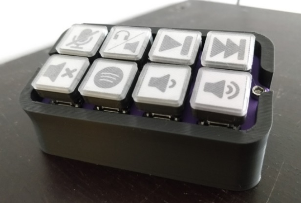
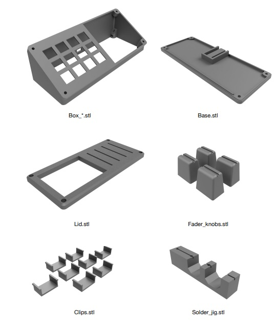

# StreamDeck

#### Project Status:  Developing ⚠️

Projeto inspirado no  <a href="https://www.thingiverse.com/thing:4627779">MisterDeck</a> 

As peças podem ser baixadas pelo link no <a href="https://www.thingiverse.com/thing:4627779">Thingiverse</a> 

---

<!-- TABLE OF CONTENTS -->

  
Conteudo

  <ol>
    <li><a href="#Introdução">Introdução</a></li>
    <li><a href="#Lista-de-materiais">Peças do projeto</a></li>
    <li><a href="#impressao">Configurações de impressão</a></li>
    <li><a href="#solda">Ligações e Solda</a></li>
    <li><a href="#montagem">Montagem</a></li>
    <li><a href="#arduino">Configuração Arduino</a></li>
    <li><a href="#obs">Configuração OBS</a></li>
  </ol>

<!-- ABOUT THE PROJECT -->
## Introdução 
<!--

   
 
 
-->
Obrigado por baixar, o deck de stream MIDI baseado em Arduino. Essas instruções
irá guiá-lo através do processo de fabricação e uso do dispositivo. Todos os créditos do projeto são dados para o desenvolvedor <a href="https://www.twitch.tv/mister_ofcl">MisterRdeck</a>, alguns comentário foram adicionados por mim para facilitara montagem e traduzir o processo de construção.

### O que é necessário?
Conhecimento básico de solda, a capacidade de seguir as instruções, um pouco de bom senso;)

### Ferramentas
* Chave hexagonal M3
* Ferro de soldar + solda
* Supercola / fita dupla-face (A boa viu?)
* Pinças (muito úteis para posicionar fios)

### Licença
Este trabalho está licenciado sob a licença Creative Commons - Atribuição-Compartilhamento pela mesma Licença 4.0 Internacional
licença. Para ver uma cópia desta licença, visite: https://creativecommons.org/licenses/by-sa/4.0/

   
 
 

---

### Lista de materiais

Item | Qtd 
---- | :----:
Poteciômentro 10k Linear Slide (45mm travel, dimensions 60mm x 9mm) | 4
Switch Cherry Mx Para Teclado Mecânico | 12
keycaps (Impresso) | 12
Diodo 1N4148 | 12
Arduino Micro (Clone) | 1
Parafuso Allen M3x10mm | 8
Porcas M3 | 8
Inserto Latão Rosca M3 | 4

---

Recomendado, mas não essencial. Os keycaps impressos em 3D isso reduz um pouco o custo.
Se você tem algum filamento transparente, as teclas imprimíveis de Mc_gee são uma alternativa fantástica
(https://www.thingiverse.com/thing:3791028/files).

   
 
 

---

### Peças Imprimíveis

   
 
 

Todas as peças imprimíveis podem ser visualizadas e baixadas no site <a href="https://www.thingiverse.com/thing:4627779">Thingiverse.</a> 

><i> Não estamos disponibilizando os arquivos aqui no github pois eles poderão sofrer modificações. Recomendamos acessar o link do site de origem.

---

***** Continuar a Edição *****
